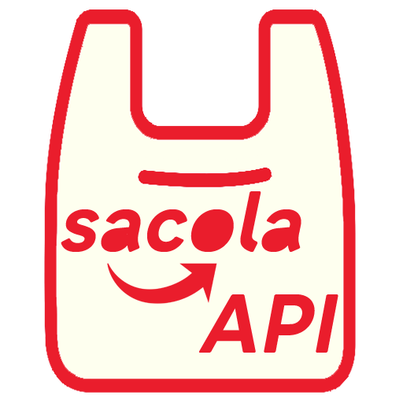
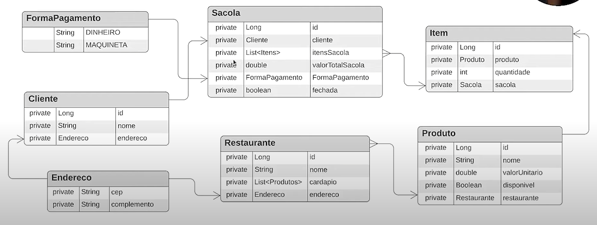
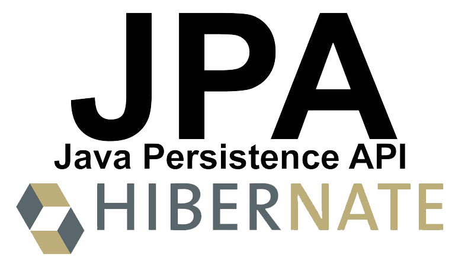

<p align="center">
  
</p>

# sacola_API

<h4 align="center"> 
	 Status: Under development.
</h4>

<br/>

**Simple Backend API to serve a Frontend Application with a food delivery domain.**

---

<p align="center">
  <a href="#about">About</a> •
  <a href="#learnings">Learnings</a> •
  <a href="#preview">Preview</a> •
  <a href="#tech-stack-and-tools">Tech Stack and tools</a> •
  <a href="#publication">Publication</a> •
  <a href="#author">Author</a> 
</p>

---

## About
<br/>

Project developed as a FREE starter for a DIO's Bootcamp wich I didn't do.

A Backend API made using **Java**, **Spring Boot**, **Gradle**, **Hibernate - Jakarta Persistense (JPA)**, **H2 in-memory Database**, and documented using **Swagger UI**, that will allow you to add itens, see and close the bag preparing for order.

**ATTENTION** ⚠️:

> Because it is a in-memory Database, data will not persist on disk and will be lost whenever the application is refreshed.

## Learnings
<br/>

- Basic understanding of:
  - Operational Systems;
  - Java programming language;
  - IntelliJ IDEA Community;
  - Git and GitHub;
  
  <details open>
  <summary>Object Oriented Programming -> OOP:</summary>
  <br/>

  - Abstraction;
  - Encapsulation;
  - Inheritance;
  - Composition;
  - Polymorphism;
  - Instances - Classes X Objects;
  
  </details>

  <details open>
  <summary>Computational thinking:</summary>
  <br/>

  - What the problems are and how the application solves them;

  </details>

  <details open>
  <summary>Application domain:</summary>
  <br/>

  - Understanding the project;

  </details>

  <details open>
  <summary>Entity-relantionship Diagram:</summary>

  <h2 align="center">
    
  </h2>

  </details>

  - REST APIs;
  - HTTP verbs;

  <details open>
  <summary>Spring Boot Application architecture;:</summary>
  <br/>

  - Spring Initialzr;
  - Lombok;
  - H2 in memory Database;
  - Builder Design pattern;

  </details>
  
  - Postman;
  - Swagger UI;


## Preview

<h1 align="center">
	
</h1>

## Tech Stack and tools

<div style="display: inline_block"><br>
    
    
    
    
    
    
    
    
</div>

## Publication

<br/>

> Clone this repository!

- Make a clone of this repository:

  ```bash
  git clone git@github.com:Macedovin/sacola_API.git
  ```

- Access the repository directory:

  ```bash
  cd sacola_API
  ```
- If you haven't installed Gradle on your Machine, then use the following Gradle command to run the Spring Boot application:

  ```bash
  ./gradlew bootrun
  ```
- With the application running, at your browser of choice, access this URL:

  - Copy it from here and paste there:

      ```bash
      http://localhost:8080/swagger-ui/
      ```
  - Or, click this link:

    > http://localhost:8080/swagger-ui/
    
🚨  **ATTENTION** ⚠️:

> Because it is a in-memory Database, data will not persist on disk and will be lost whenever the application is refreshed.

## Author

<br/>


Project created by [Camila Cavalcanti](https://github.com/cami-la), for [DIO - Digital Innovation One](https://github.com/digitalinnovationone) and developed by [Vinicius&nbsp;Macedo](https://github.com/Macedovin).

<a href="mailto:macedo.vp@gmail.com" target="_blank"></a>&nbsp;
<a href="https://www.linkedin.com/in/vinicius-macedop/" target="_blank"></a>&nbsp;